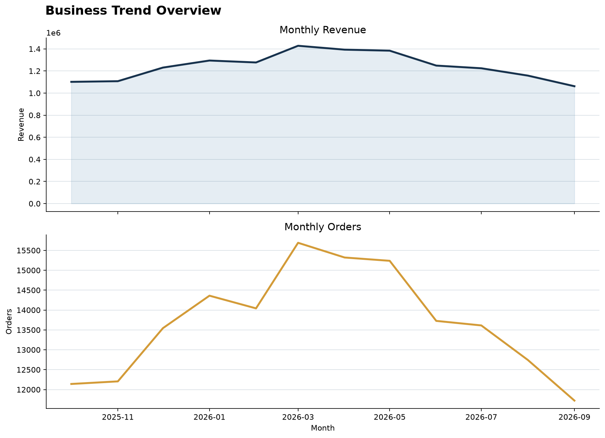
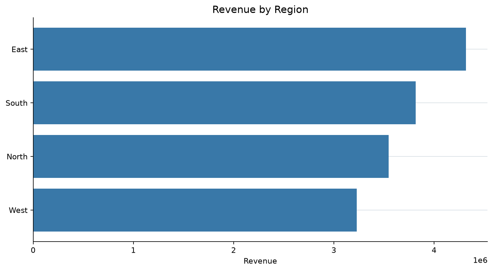
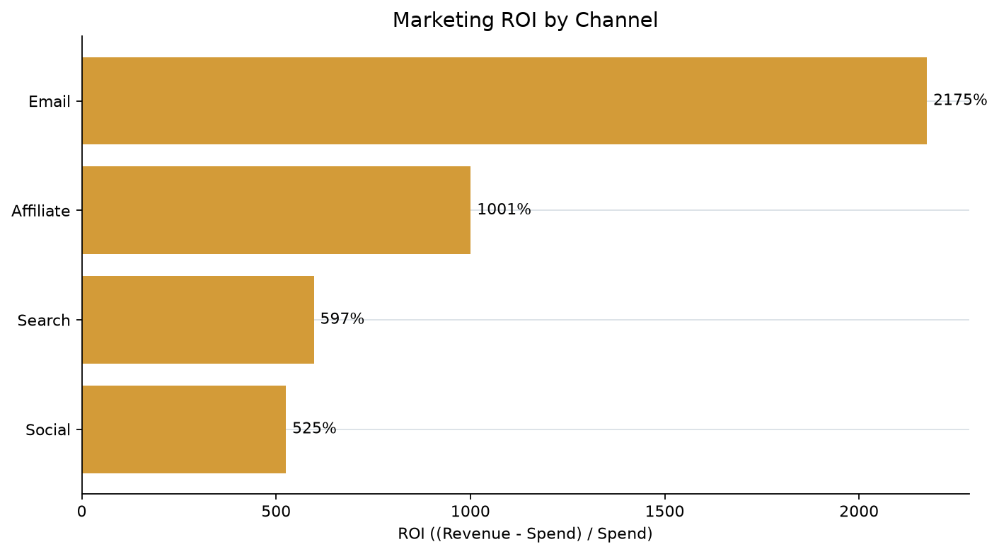
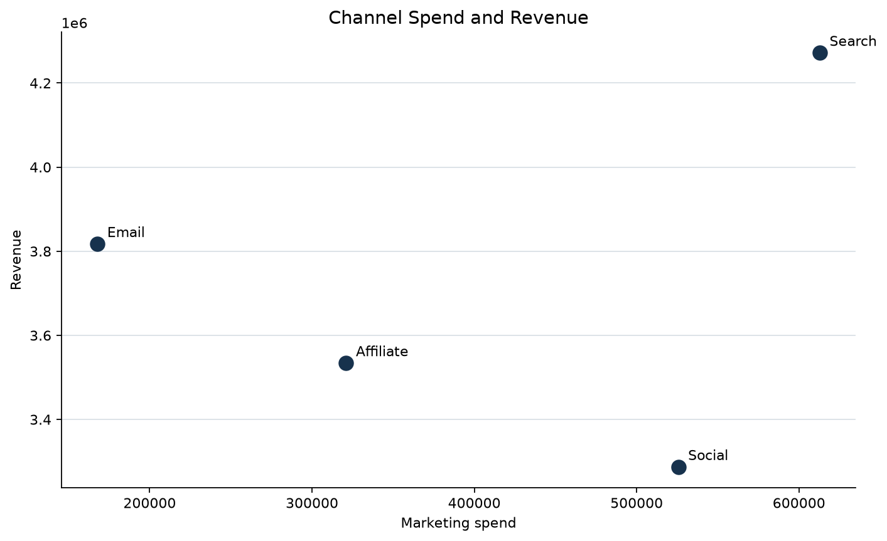

# 模拟数据可视化分析报告

> 本报告基于固定随机种子生成的模拟电商经营数据，仅用于展示数据分析方法，不代表真实市场证据。

## 1. 数据概览

- 分析粒度：日 × 地区 × 获客渠道
- 客户数：2,792,312
- 订单数：164,351
- 收入：$14,909,603
- 营销投入：$1,627,354
- 加权转化率：5.89%
- 整体 ROI：816.19%

## 2. 关键发现

1. **地区贡献**：East 的累计收入最高，适合作为规模贡献的重点观察区域。
2. **渠道效率**：Email 的 ROI 最高，说明其在当前模拟设定下的投入产出效率更优。
3. **解读边界**：渠道比较同时受到流量规模、转化率、客单价和营销投入设定影响，不能仅凭 ROI 判断因果关系。

## 3. 输出图表

## 4. 方法说明

数据由 `numpy.random.default_rng(seed)` 可重复生成；汇总指标使用订单数/客户数计算加权转化率，使用 `(收入 - 营销投入) / 营销投入` 计算 ROI。完整明细与汇总表位于 `data/` 目录。
